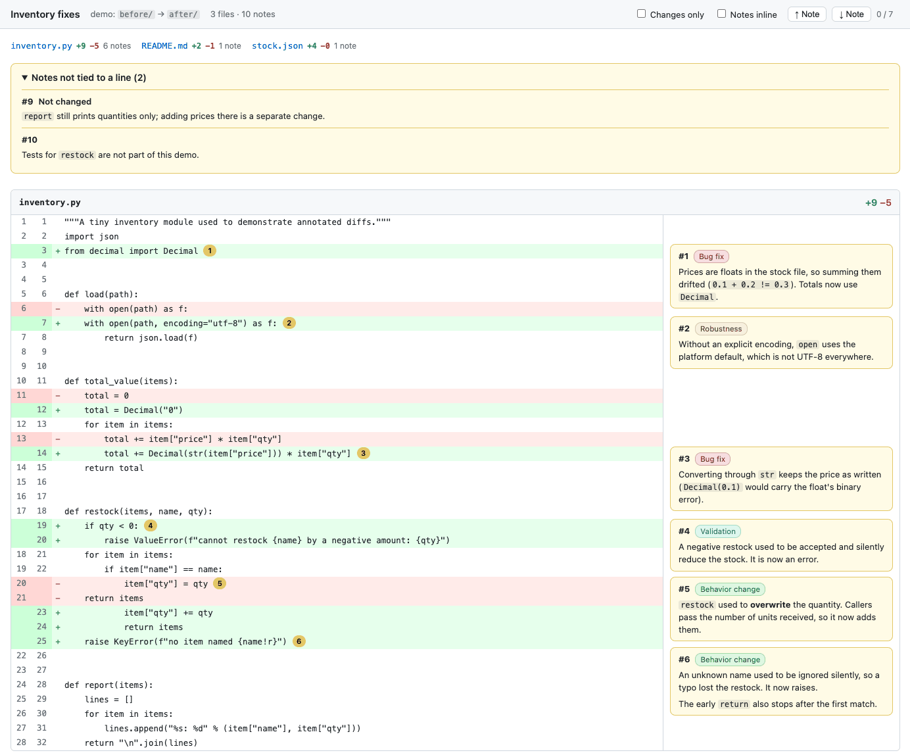
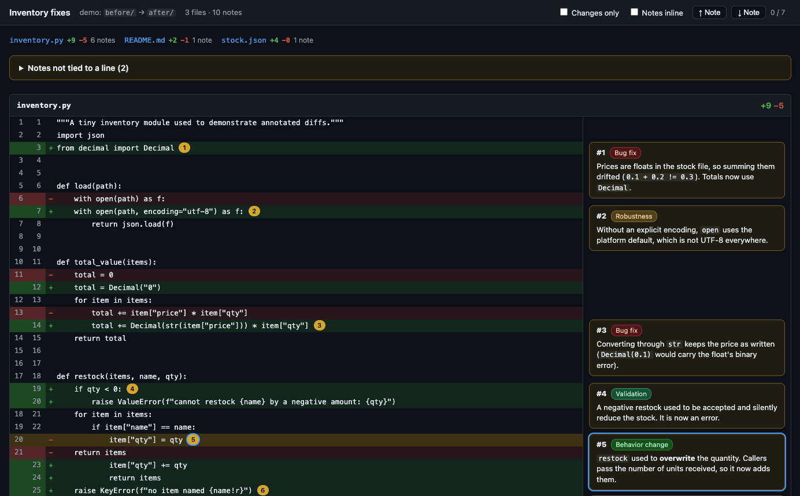
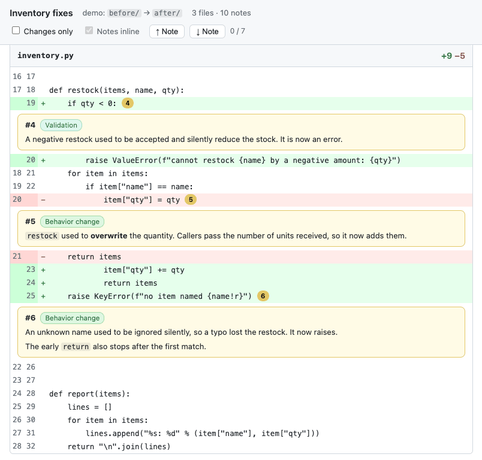

<p align="center">
  
</p>

# annotated-diff

Ask your coding agent to show you what it changed, and get a browser page instead of a wall of
terminal output: every changed file in full, GitHub-style, with the agent's notes on **why** each
change was made as cards in the margin, right next to the lines they explain.

It is an agent skill for [Claude Code](https://code.claude.com), [OpenAI Codex](https://developers.openai.com/codex)
and [Pi](https://github.com/badlogic/pi-mono/tree/main/packages/coding-agent). The agent writes
the notes, renders the page and opens it; you read and review.

<p align="center">
  
</p>

## Install

The repository is private: every method below clones it with your own git access (an SSH key
for GitHub, or for HTTPS run `gh auth login` and then `gh auth setup-git`).

**All three agents at once**, with the [`skills`](https://github.com/vercel-labs/skills) CLI
(needs Node.js):

```bash
npx skills add thomas-lane/annotated-diff -g -a claude-code -a codex -a pi
```

Update later with `npx skills update annotated-diff`.

**Or with each agent's own installer:**

| Agent | Install | Update |
|---|---|---|
| Claude Code | `/plugin marketplace add thomas-lane/annotated-diff`<br>`/plugin install annotated-diff@annotated-diff` | `/plugin marketplace update annotated-diff` |
| Codex | `codex plugin marketplace add thomas-lane/annotated-diff`<br>`codex plugin add annotated-diff@annotated-diff` | `codex plugin marketplace upgrade annotated-diff` |
| Pi | `pi install git:github.com/thomas-lane/annotated-diff`<br>(SSH: `pi install git:git@github.com:thomas-lane/annotated-diff`) | `pi update git:github.com/thomas-lane/annotated-diff` |

The Claude Code commands also work from a shell as `claude plugin marketplace add ...` and
`claude plugin install ...`. Claude Code tries SSH first; set `CLAUDE_CODE_PLUGIN_PREFER_HTTPS=1`
on a machine without a GitHub SSH key. Start a new session (or restart Codex) after installing.

Requirements on the machine: `python3` 3.9 or later and `git`. Nothing else is installed.

## Usage

Work with your agent as usual. When you want to review what it did, ask for an annotated diff:

| Agent | Type |
|---|---|
| Claude Code | `/annotated-diff` (as a plugin: `/annotated-diff:annotated-diff`) |
| Codex | `$annotated-diff` (type `$` and pick it, or find it under `/skills`) |
| Pi | `/skill:annotated-diff` |

Add what you want to see after the command, or just ask in plain words. The agent picks the
skill up on its own from requests like these:

- "Show me an annotated diff of what you changed."
- "Show me an annotated diff of everything since `main`."
- "Walk me through this branch in the browser, with notes on why each change was made."
- "Explain your changes line by line, in the browser."
- "I reviewed the last page. Show me only what changed since then."

The agent then:

1. picks the base: the version you last saw (your last commit, the branch point, or the previous
   review), so the page shows only what is new to you;
2. writes one short note per meaningful change, saying what changed and why, and flagging risks,
   behavior changes and anything it did not verify;
3. renders the page, fixes any note it could not place, and opens it in your browser.

You get one HTML file (in your system temp directory unless you ask for another place) that
works offline and can be attached or shared as is.

<table>
  <tr>
    <td width="50%"></td>
    <td width="50%"></td>
  </tr>
  <tr>
    <td>Dark mode follows the system. Hover a card to highlight its line.</td>
    <td>On a narrow window (or with "Notes inline") the notes sit under their lines.</td>
  </tr>
</table>

On the page:

- click a card to jump to its line, or a line's numbered pin to jump to its card;
- "Changes only" folds unchanged lines into expandable "N unchanged lines" bars;
- ↑/↓ (or the j/k keys) step through the notes;
- notes about the change as a whole sit in a panel at the top, together with any note whose line
  could not be found (marked "line not found").

## Demo

`examples/demo/` has a before/after copy of a small module and a notes file. It renders the page
in the screenshots:

```bash
examples/demo/render.sh /tmp/annotated-diff-demo.html --open
```

## Script reference (for agents and scripting)

The agent follows [`skills/annotated-diff/SKILL.md`](skills/annotated-diff/SKILL.md), which
documents the notes format and how to choose a base. The generator is one file,
`skills/annotated-diff/scripts/annotated_diff.py` (Python 3.9+, standard library only, plus
`git` in git mode), and also runs on its own:

```bash
S=skills/annotated-diff/scripts/annotated_diff.py

# Working tree (including untracked files) against a commit
python3 $S --repo . --base main --notes notes.json --open

# A branch against where it forked from main, limited to some paths
python3 $S --repo . --base main --head feature --merge-base 'src/*.py' --notes notes.json

# Without git: explicit before/after pairs (/dev/null for a missing side)
python3 $S --pair app.py old/app.py new/app.py --notes notes.json --out review.html
```

A notes file looks like this. `anchor` is a fragment of one added line (prefix `-` for a removed
line); a note without an anchor is about the whole file:

```json
{
  "comments": [
    {"file": "src/app.py", "anchor": "def load(", "label": "Bug fix",
     "note": "Why this changed. `code` and **bold** are rendered."}
  ],
  "general": [{"title": "Not tied to a line", "note": "..."}]
}
```

`python3 $S --help` lists every option. Exit status: 0 on success, 1 with `--strict` when a note
could not be placed or an anchor is ambiguous, 2 on bad input.

## Development

```bash
python3 -m unittest discover -s tests   # tests (stdlib unittest)
claude plugin validate .                 # plugin manifests (Claude Code; Codex reads the same files)
```

```
skills/annotated-diff/SKILL.md                    the skill: instructions the agent follows
skills/annotated-diff/scripts/annotated_diff.py   the generator
.claude-plugin/marketplace.json                   plugin marketplace, read by Claude Code and Codex
.claude-plugin/plugin.json                        plugin manifest; the plugin is the repository root
examples/demo/                                    before/after files, notes.json, render.sh
assets/                                           README images (the banner was generated with Codex)
tests/test_annotated_diff.py                      unit tests
```
